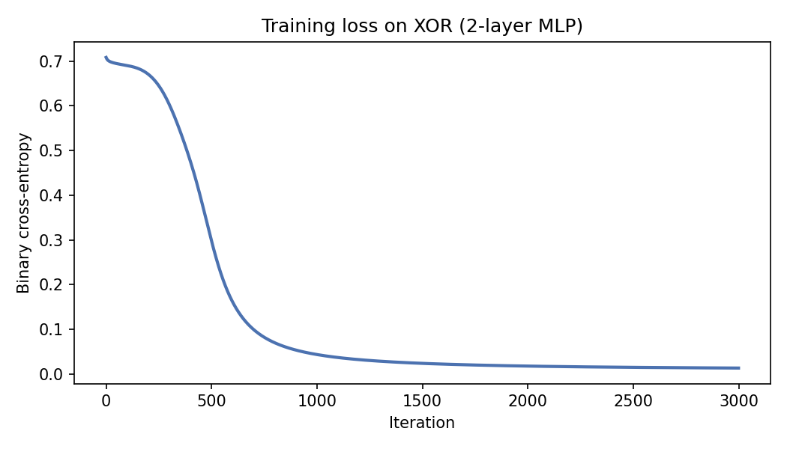
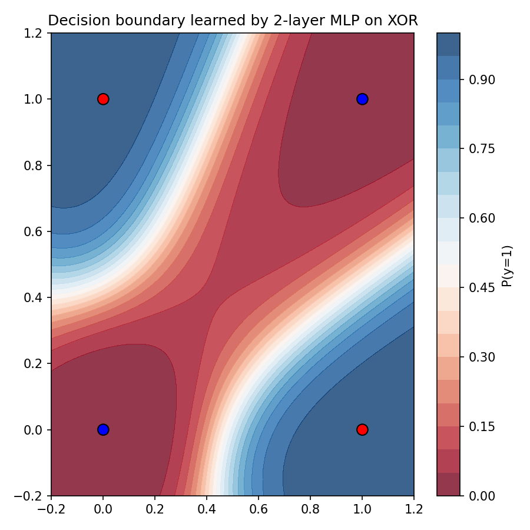

Backpropagation
===============

Goal
----
Explain the backpropagation algorithm for feed-forward neural networks, derive gradients via the chain rule, and provide a NumPy reference implementation with illustrative figures.

Setup: two-layer MLP
--------------------
Given inputs :math:`X \in \mathbb{R}^{n \times d}` and targets :math:`y \in \{0,1\}` for binary classification, with hidden width :math:`h`:

.. math::

   z_1 = X W_1 + \mathbf{1} b_1^T, \quad a_1 = \phi(z_1)

   z_2 = a_1 W_2 + \mathbf{1} b_2^T, \quad \hat{y} = \sigma(z_2)

- :math:`W_1 \in \mathbb{R}^{d \times h}`, :math:`b_1 \in \mathbb{R}^{h}`
- :math:`W_2 \in \mathbb{R}^{h \times 1}`, :math:`b_2 \in \mathbb{R}`
- Activation :math:`\phi` (e.g., :math:`\tanh` or ReLU), sigmoid output :math:`\sigma(z) = 1/(1+e^{-z})`.
- Loss (binary cross-entropy):

  .. math::

     \mathcal{L} = - \frac{1}{n} \sum_{i=1}^n \left[ y_i \log \hat{y}_i + (1-y_i) \log (1-\hat{y}_i) \right].

Chain rule (scalar view)
------------------------
For a single sample, backprop flows gradients from output to parameters:

.. math::

   \delta_2 = \frac{\partial \mathcal{L}}{\partial z_2} = \hat{y} - y

   \frac{\partial \mathcal{L}}{\partial W_2} = a_1^T \delta_2, \quad \frac{\partial \mathcal{L}}{\partial b_2} = \delta_2

   \delta_1 = (\delta_2 W_2^T) \odot \phi'(z_1)

   \frac{\partial \mathcal{L}}{\partial W_1} = X^T \delta_1, \quad \frac{\partial \mathcal{L}}{\partial b_1} = \delta_1.

Vectorized over the batch, replace transposes with matrix multiplies as above and scale by :math:`1/n`.

Error signals and shapes
------------------------
- :math:`\delta_2 \in \mathbb{R}^{n \times 1}` matches :math:`z_2`.
- :math:`\delta_1 \in \mathbb{R}^{n \times h}` matches :math:`z_1`.
- Parameter gradients share the shape of their parameters: :math:`\nabla W_2 \in \mathbb{R}^{h \times 1}`, :math:`\nabla b_2 \in \mathbb{R}`, :math:`\nabla W_1 \in \mathbb{R}^{d \times h}`, :math:`\nabla b_1 \in \mathbb{R}^h`.

Gradient flow intuition
-----------------------
- Output error :math:`\delta_2` scales with prediction mismatch :math:`\hat{y}-y`.
- Hidden error :math:`\delta_1` gates through both the upstream weights :math:`W_2` and activation slope :math:`\phi'(z_1)`.
- Vanishing/exploding arise when repeated multiplication by activation slopes and weights drives signals to 0 or large magnitudes.

Numerical stability tips
------------------------
- Use :math:`\tanh` or ReLU; avoid saturating sigmoids in hidden layers.
- Clip logits when computing cross-entropy to avoid log of 0.
- Initialize with small random weights (e.g., Xavier/Glorot for tanh: variance :math:`1/d`).
- Add :math:`L_2` penalty to weights to reduce overfitting.

NumPy reference implementation
------------------------------
.. code-block:: python

    import numpy as np

    def sigmoid(x):
        return 1 / (1 + np.exp(-x))

    def sigmoid_grad(x):
        s = sigmoid(x)
        return s * (1 - s)

    def tanh_grad(x):
        t = np.tanh(x)
        return 1 - t**2

    def forward(X, params, activation=np.tanh):
        W1, b1, W2, b2 = params
        z1 = X @ W1 + b1
        a1 = activation(z1)
        z2 = a1 @ W2 + b2
        y_hat = sigmoid(z2)
        cache = (X, z1, a1, z2)
        return y_hat, cache

    def loss_and_grads(X, y, params, activation=np.tanh, activation_grad=tanh_grad):
        n = len(X)
        W1, b1, W2, b2 = params
        y_hat, (X, z1, a1, z2) = forward(X, params, activation=activation)

        # Binary cross-entropy
        eps = 1e-9
        loss = -np.mean(y * np.log(y_hat + eps) + (1 - y) * np.log(1 - y_hat + eps))

        delta2 = (y_hat - y) / n  # shape (n,1)
        grad_W2 = a1.T @ delta2
        grad_b2 = np.sum(delta2, axis=0)

        delta1 = (delta2 @ W2.T) * activation_grad(z1)
        grad_W1 = X.T @ delta1
        grad_b1 = np.sum(delta1, axis=0)

        grads = (grad_W1, grad_b1, grad_W2, grad_b2)
        return loss, grads

    def update(params, grads, lr=0.1, weight_decay=0.0):
        W1, b1, W2, b2 = params
        gW1, gb1, gW2, gb2 = grads
        W1 = W1 - lr * (gW1 + weight_decay * W1)
        b1 = b1 - lr * gb1
        W2 = W2 - lr * (gW2 + weight_decay * W2)
        b2 = b2 - lr * gb2
        return (W1, b1, W2, b2)

    # Toy XOR data
    X = np.array([[0,0],[0,1],[1,0],[1,1]], dtype=float)
    y = np.array([[0],[1],[1],[0]], dtype=float)

    rng = np.random.default_rng(0)
    h = 4
    W1 = rng.normal(scale=np.sqrt(1 / X.shape[1]), size=(2, h))
    b1 = np.zeros(h)
    W2 = rng.normal(scale=np.sqrt(1 / h), size=(h, 1))
    b2 = np.zeros(1)
    params = (W1, b1, W2, b2)

    losses = []
    for _ in range(2000):
        loss, grads = loss_and_grads(X, y, params)
        params = update(params, grads, lr=0.1, weight_decay=1e-3)
        losses.append(loss)

    print("Final loss:", losses[-1])

Figures
-------
The accompanying script generates:

- Training loss curve (convergence on XOR)
- Decision boundary over the unit square

Reproduce the figures
---------------------
Run the generator script after edits:

.. code-block:: bash

   python docs/_static_files/codes/backpropagation.py

It will write the PNGs under ``docs/_static_files/images`` and print the final loss for sanity checking.
