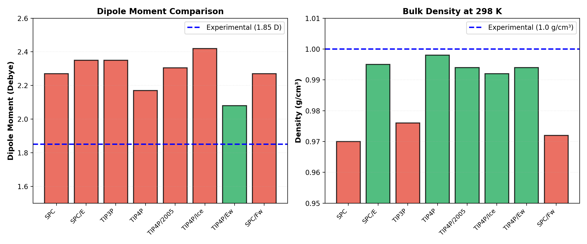

Force Fields : Water
======================

**Overview**

A molecular force field is a set of mathematical functions and parameters that define the potential energy of a system as a function of atomic coordinates. Force fields enable:

- Simulation of molecular dynamics and structural properties
- Calculation of thermodynamic properties (density, heat capacity, diffusion)
- Prediction of spectroscopic properties (IR, Raman, neutron scattering)
- Efficient exploration of conformational space via molecular dynamics (MD)

In this section, we focus on **intermolecular interactions** and popular water models, which dominate simulations in biochemistry, materials science, and environmental science.

Intermolecular Interactions: General Principles
---------------------------------------------

**Long-Range Interactions**

Long-range interactions decay slowly with distance and must be evaluated over many molecules. Common long-range forces:

1. **Coulombic (Electrostatic) Interactions**

   Two point charges :math:`q_i` and :math:`q_j` separated by distance :math:`r_{ij}`:

   .. math::

       V_{\text{elec}}(r_{ij}) = k_e \frac{q_i q_j}{r_{ij}}

   where :math:`k_e = 8.988 \times 10^9 \, \text{N·m}^2\text{·C}^{-2}` (in vacuum) or :math:`k_e = 1389.4 \, \text{kcal·Å·mol}^{-1}\text{·e}^{-2}` (chemistry units).

   - Range: :math:`\sim 1/r` → extends to ~20 Å with noticeable effects
   - Crucial for ions, charged residues, dipolar molecules (like water)
   - Often computed via Ewald summation or PME (Particle Mesh Ewald) for periodic systems

2. **Dispersion (Van der Waals) Interactions**

   Induced dipole attractions from quantum fluctuations:

   .. math::

       V_{\text{disp}}(r_{ij}) = -\frac{C_6}{r_{ij}^6}

   - Range: :math:`\sim 1/r^6` → decays faster than Coulomb
   - Typically combined with short-range repulsion to form Lennard-Jones or similar potentials

**Close-Range Interactions (Short-Range)**

Short-range interactions dominate at small separations and are often treated with pair potentials evaluated up to a cutoff (\~12 Å).

1. **Repulsive (Pauli) Interactions**

   Born repulsion due to orbital overlap and Pauli exclusion:

   .. math::

       V_{\text{rep}}(r_{ij}) = A \exp\left(-\frac{r_{ij}}{\rho}\right) \quad \text{or} \quad \frac{B}{r_{ij}^{12}}

   - Dominates at :math:`r < 3` Å
   - Often modeled as :math:`1/r^{12}` (Lennard-Jones 12-6)

2. **Lennard-Jones (LJ) Potential**

   The **12-6 LJ** potential combines repulsion and dispersion:

   .. math::

       V_{\text{LJ}}(r_{ij}) = 4\varepsilon_{ij} \left[ \left(\frac{\sigma_{ij}}{r_{ij}}\right)^{12} - \left(\frac{\sigma_{ij}}{r_{ij}}\right)^{6} \right]

   where:

   - :math:`\varepsilon_{ij}` = well depth (attraction strength)
   - :math:`\sigma_{ij}` = collision diameter (where :math:`V = 0`)
   - :math:`r_{\min} = 2^{1/6}\sigma_{ij} \approx 1.122 \sigma_{ij}` (equilibrium distance)

3. **Combining Rules**

   For unlike pairs (atom types :math:`i \neq j`):

   - **Arithmetic mean (Lorentz rule):** :math:`\sigma_{ij} = \frac{1}{2}(\sigma_i + \sigma_j)`
   - **Geometric mean (Berthelot rule):** :math:`\varepsilon_{ij} = \sqrt{\varepsilon_i \varepsilon_j}`

**Intramolecular Terms** (brief overview)

While this section focuses on intermolecular interactions, many force fields also include:

- **Bond stretching:** :math:`V_b = k_b(r - r_0)^2`
- **Angle bending:** :math:`V_\theta = k_\theta(\theta - \theta_0)^2`
- **Dihedral torsions:** :math:`V_\phi = \sum_n V_n [1 + \cos(n\phi - \gamma_n)]`

These are critical for molecular structure and are extensively parameterized in most force fields.

Water Models Overview
---------------------------------------------

Water is the most abundant molecule in biological and environmental systems. Its small size, strong intermolecular forces, and anomalous properties (e.g., density maximum at 4°C) make it a benchmark for force field development.

**Key Properties to Match**

- **Dipole moment** (:math:`\mu`): ~1.85 Debye (experimental)
- **Density** (:math:`\rho`): ~1.0 g/cm³ at 298 K
- **Dielectric constant** (:math:`\varepsilon_r`): ~80 at room temperature
- **Heat of vaporization** (:math:`\Delta H_{\text{vap}}`): ~10.5 kcal/mol
- **Radial distribution function** (RDF) g(r): shape and peaks
- **Self-diffusion coefficient** (D): ~2.3 × 10⁻⁵ cm²/s at 298 K

**Model Classification**

Water models are classified by:

1. **Geometry:** Rigid vs. flexible bonds
2. **Charge sites:** 3-site (O, H, H), 4-site (O + virtual M), 5-site (O, 2H, 2 virtual)
3. **Functional form:** Coulomb + LJ, or with additional terms

**Naming Convention**

- **SPC:** Simple Point Charge (3 sites)
- **TIP:** Transferable Intermolecular Potential (3 or 4 sites)
- **q-TIP4P/f:** Quantum Drude oscillator variant
- **-EW / -Ew:** Ewald summation optimized

Detailed Water Model Comparison
---------------------------------------------

We now examine eight popular water models in detail, organized from simplest to most sophisticated.

1. SPC (Simple Point Charge)
-----------------------------

**Publication:** Berendsen et al. (1981)

**Geometry:** 3-site rigid model

.. math::

    \begin{array}{c|cccc}
    \text{Site} & x \text{ (Å)} & q \text{ (e)} & \sigma \text{ (Å)} & \varepsilon \text{ (kcal/mol)} \\
    \hline
    \text{O} & 0 & -0.82 & 3.1656 & 0.1554 \\
    \text{H} & 0.8155 & 0.41 & 0 & 0 \\
    \text{H} & -0.8155 & 0.41 & 0 & 0
    \end{array}

where :math:`x` is distance along O–H bond axis.

**Key Characteristics:**

- **Dipole moment:** 2.27 D (overestimated by ~23%)
- **O–H distance:** 1.0 Å (rigid)
- **H–O–H angle:** 109.47° (rigid)
- **Complexity:** Very low; runs fastest
- **LJ parameters:** O atom only (H atoms have no VdW)
- **Cutoff:** Typically 10–12 Å

**Strengths:**

- Extremely fast; widely used in large simulations
- Reasonable liquid structure
- Good for non-aqueous systems

**Weaknesses:**

- Dipole moment too high → overestimates dielectric constant
- Surface tension underestimated
- Hydrophobic effect overestimated

2. SPC/E (SPC Extended)
-----------------------

**Publication:** Berendsen et al. (1987)

**Geometry:** 3-site rigid model (same as SPC)

.. math::

    \begin{array}{c|cccc}
    \text{Site} & x \text{ (Å)} & q \text{ (e)} & \sigma \text{ (Å)} & \varepsilon \text{ (kcal/mol)} \\
    \hline
    \text{O} & 0 & -0.8476 & 3.1656 & 0.1554 \\
    \text{H} & 0.8155 & 0.4238 & 0 & 0 \\
    \text{H} & -0.8155 & 0.4238 & 0 & 0
    \end{array}

**Key Characteristics:**

- **Dipole moment:** 2.35 D (closer to experiment: 1.85 D)
- **O–H distance:** 1.0 Å
- **H–O–H angle:** 109.47°
- **Complexity:** Very low (identical to SPC)
- **Cutoff:** 10–12 Å

**Changes from SPC:**

Slightly adjusted charge distribution to improve properties.

**Strengths:**

- Better dipole moment than SPC
- Improved dielectric constant
- Still fast
- More stable for long simulations

**Weaknesses:**

- Still overestimates dipole moment compared to gas-phase value
- Dielectric constant still somewhat high

3. TIP3P (Transferable Intermolecular Potential, 3-site)
------------------------------------------------------

**Publication:** Jorgensen et al. (1983)

**Geometry:** 3-site rigid model

.. math::

    \begin{array}{c|cccc}
    \text{Site} & x \text{ (Å)} & q \text{ (e)} & \sigma \text{ (Å)} & \varepsilon \text{ (kcal/mol)} \\
    \hline
    \text{O} & 0 & -0.834 & 3.1506 & 0.1520 \\
    \text{H} & 0.9572 & 0.417 & 0 & 0 \\
    \text{H} & -0.9572 & 0.417 & 0 & 0
    \end{array}

**Key Characteristics:**

- **Dipole moment:** 2.35 D
- **O–H distance:** 0.9572 Å (experimental geometry)
- **H–O–H angle:** 104.52° (experimental)
- **Complexity:** Low
- **Cutoff:** 10–12 Å

**Why "Transferable":**

TIP3P was parameterized to match intermolecular interactions from ab initio calculations, intending better transferability to different environments.

**Strengths:**

- Uses experimental O–H and H–O–H geometry
- Good hydrogen bonding geometry
- Widely used; extensive literature
- Computational efficiency comparable to SPC/E

**Weaknesses:**

- Dipole moment still overestimated (~27% higher)
- Known to form too-stable hydrogen bonds
- Surface tension underestimated
- Dielectric constant higher than experiment

4. TIP4P (Transferable Intermolecular Potential, 4-site)
-------------------------------------------------------

**Publication:** Jorgensen et al. (1983)

**Geometry:** 4-site rigid model with virtual M site (virtual point representing the negative charge center)

.. math::

    \begin{array}{c|cccc}
    \text{Site} & \text{Position} & q \text{ (e)} & \sigma \text{ (Å)} & \varepsilon \text{ (kcal/mol)} \\
    \hline
    \text{O} & \text{origin} & 0.52 & 3.1536 & 0.1550 \\
    \text{H} & 0.9572 \text{ Å from O} & 0.24 & 0 & 0 \\
    \text{H} & 0.9572 \text{ Å from O} & 0.24 & 0 & 0 \\
    \text{M} & 0.15 \text{ Å from O (toward bisector)} & -0.52 & 0 & 0
    \end{array}

**O–H distance:** 0.9572 Å  
**H–O–H angle:** 104.52°  
**O–M distance:** 0.15 Å

**Key Characteristics:**

- **Dipole moment:** 2.17 D (closer to experiment)
- **Complexity:** Medium (virtual site computation)
- **Cutoff:** 10–12 Å with Ewald summation recommended

**Virtual Site Concept:**

The negative charge is displaced from the oxygen toward the hydrogen lone-pair direction. This decouples the LJ repulsion center (on O) from the charge center (on M), improving properties.

**Strengths:**

- Better dipole moment than TIP3P
- Improved dielectric constant and hydrogen bonding
- Excellent liquid structure (RDF)
- Good compromise between accuracy and speed

**Weaknesses:**

- Slightly more expensive than TIP3P (M site calculation)
- Still overestimates some properties
- Virtual site requires special handling in some codes

5. TIP4P/2005 (TIP4P Refined, 2005)
-----------------------------------

**Publication:** Abascal & Vega (2005)

**Geometry:** 4-site rigid model (similar structure to TIP4P)

.. math::

    \begin{array}{c|cccc}
    \text{Site} & \text{Position} & q \text{ (e)} & \sigma \text{ (Å)} & \varepsilon \text{ (kcal/mol)} \\
    \hline
    \text{O} & \text{origin} & 0.5564 & 3.1589 & 0.1852 \\
    \text{H} & 0.9572 \text{ Å from O} & 0.2722 & 0 & 0 \\
    \text{H} & 0.9572 \text{ Å from O} & 0.2722 & 0 & 0 \\
    \text{M} & 0.1546 \text{ Å from O (toward bisector)} & -0.5564 & 0 & 0
    \end{array}

**Key Characteristics:**

- **Dipole moment:** 2.305 D
- **Complexity:** Medium (same as TIP4P)
- **Cutoff:** 10–12 Å with Ewald summation

**Improvements over TIP4P:**

Re-parameterized to better match:

- Bulk density across a wider temperature range
- Heat of vaporization
- Liquid structure

**Strengths:**

- Superior density and thermodynamic properties across temperature range
- Excellent balance of properties
- One of the most accurate models for standard conditions
- Good hydrogen bonding

**Weaknesses:**

- Slightly more expensive (though similar to TIP4P)
- Less widespread use historically (but growing)

6. TIP4P/Ice
-----------

**Publication:** Vega et al. (2009)

**Geometry:** 4-site rigid model (TIP4P-like architecture)

.. math::

    \begin{array}{c|cccc}
    \text{Site} & \text{Position} & q \text{ (e)} & \sigma \text{ (Å)} & \varepsilon \text{ (kcal/mol)} \\
    \hline
    \text{O} & \text{origin} & 0.6113 & 3.1668 & 0.1852 \\
    \text{H} & 0.9572 \text{ Å from O} & 0.1943 & 0 & 0 \\
    \text{H} & 0.9572 \text{ Å from O} & 0.1943 & 0 & 0 \\
    \text{M} & 0.1577 \text{ Å from O (toward bisector)} & -0.6113 & 0 & 0
    \end{array}

**Key Characteristics:**

- **Dipole moment:** 2.42 D
- **Complexity:** Medium
- **Designed for:** Ice and solid-liquid interfaces

**Specific Parameterization:**

TIP4P/Ice was specifically optimized to reproduce:

- Ice polymorphs (Ih, II, III, V, VI, VII, VIII)
- Ice–water interfacial properties
- Melting point and phase diagram

**Strengths:**

- Best model for ice phases and ice-water interfaces
- Excellent solid-state properties
- Reproduces Ih melting point remarkably well

**Weaknesses:**

- Slightly worse for pure liquid water properties than TIP4P/2005
- Optimized for cold temperatures

7. TIP4P/Ew (TIP4P with Ewald summation)
----------------------------------------

**Publication:** Horn et al. (2004)

**Geometry:** 4-site rigid model

.. math::

    \begin{array}{c|cccc}
    \text{Site} & \text{Position} & q \text{ (e)} & \sigma \text{ (Å)} & \varepsilon \text{ (kcal/mol)} \\
    \hline
    \text{O} & \text{origin} & 0.52422 & 3.1640 & 0.1852 \\
    \text{H} & 0.9572 \text{ Å from O} & 0.23788 & 0 & 0 \\
    \text{H} & 0.9572 \text{ Å from O} & 0.23788 & 0 & 0 \\
    \text{M} & 0.1250 \text{ Å from O (toward bisector)} & -0.52422 & 0 & 0
    \end{array}

**Key Characteristics:**

- **Dipole moment:** 2.08 D (lower than TIP4P)
- **Complexity:** Medium
- **Explicitly for:** Periodic boundary conditions with Ewald summation

**Why Ewald-Specific?**

Parameterized assuming full electrostatic treatment via Ewald/PME rather than cutoff-based Coulomb. This changes the effective electrostatic environment and thus optimal parameters.

**Strengths:**

- Excellent for periodic simulations with full Ewald
- Better density predictions
- Lower dipole moment (more physical)
- Good thermodynamic properties

**Weaknesses:**

- Must use Ewald summation (not suitable for cutoff methods)
- Less commonly used than TIP4P/2005
- Slightly reduced hydrogen bonding strength

8. SPC/Fw (SPC Flexible Water)
------------------------------

**Publication:** Wu et al. (2006)

**Geometry:** 3-site **flexible** model (O–H bonds can stretch)

.. math::

    \begin{array}{c|cc}
    \text{Flexible Bond} & k_b \text{ (kcal/mol·Å}^{-2}\text{)} & r_0 \text{ (Å)} \\
    \hline
    \text{O–H} & 450 & 1.0 \\
    \text{H–O–H angle} & 45 & 109.47°
    \end{array}

**Charges and LJ:**

.. math::

    \begin{array}{c|cccc}
    \text{Site} & q \text{ (e)} & \sigma \text{ (Å)} & \varepsilon \text{ (kcal/mol)} \\
    \hline
    \text{O} & -0.82 & 3.1656 & 0.1554 \\
    \text{H} & 0.41 & 0 & 0
    \end{array}

**Key Characteristics:**

- **Dipole moment:** ~2.27 D (similar to rigid SPC)
- **Complexity:** Medium (bond integration needed)
- **Flexibility:** Allows O–H stretch and H–O–H bend

**Advantages of Flexibility:**

- Better spectroscopic properties (IR absorption)
- More realistic vibrational dynamics
- Can couple to quantum dynamics

**Strengths:**

- Reasonably fast (similar to SPC)
- Flexible water more realistic for some applications
- Good for combined classical/quantum simulations

**Weaknesses:**

- Requires shorter time steps (stiff O–H bond)
- More CPU time than rigid models
- Spectroscopic accuracy still limited

9. q-TIP4P/f (Quantum TIP4P/f)
------------------------------

**Publication:** Burnham et al. (2002)

**Geometry:** 4-site with quantum corrections (similar to TIP4P)

.. math::

    \begin{array}{c|cccc}
    \text{Site} & \text{Position} & q \text{ (e)} & \sigma \text{ (Å)} & \varepsilon \text{ (kcal/mol)} \\
    \hline
    \text{O} & \text{origin} & 0.5200 & 3.1537 & 0.1550 \\
    \text{H} & \text{~0.9572 Å} & 0.2400 & 0 & 0 \\
    \text{H} & \text{~0.9572 Å} & 0.2400 & 0 & 0 \\
    \text{M} & 0.15 \text{ Å from O} & -0.5200 & 0 & 0
    \end{array}

**Quantum Corrections:**

Effective potential includes quantum zero-point motion contributions via:

.. math::

    V_{\text{eff}} = V_{\text{classical}} + V_{\text{quantum}}

**Key Characteristics:**

- **Dipole moment:** ~2.16 D
- **Complexity:** High (quantum averaging)
- **Designed for:** Accurate path integral molecular dynamics (PIMD)

**Advantages:**

- Accounts for nuclear quantum effects (NQE)
- Better for low-temperature properties
- Important for isotope effects (D₂O vs H₂O)

**Strengths:**

- Only model explicitly treating quantum effects
- Excellent for PIMD simulations
- More accurate density at low temperature

**Weaknesses:**

- Most computationally expensive
- Requires specialized code for quantum averaging
- Limited adoption outside quantum dynamics community

Comparative Summary Table
---------------------------------------------

|

.. csv-table:: **Water Model Properties**
   :header: "Model", "Sites", "Dipole (D)", "Density (g/cm³)", "Flexible?", "Complexity", "Cost"
   :widths: 15, 10, 12, 18, 12, 12, 10

   "SPC", "3", "2.27", "0.970", "No", "Very Low", "1x"
   "SPC/E", "3", "2.35", "0.995", "No", "Very Low", "1x"
   "TIP3P", "3", "2.35", "0.976", "No", "Very Low", "1x"
   "TIP4P", "4", "2.17", "0.998", "No", "Low", "1.1x"
   "TIP4P/2005", "4", "2.305", "0.994", "No", "Low", "1.1x"
   "TIP4P/Ice", "4", "2.42", "0.992", "No", "Low", "1.1x"
   "TIP4P/Ew", "4", "2.08", "0.994", "No", "Low", "1.1x"
   "SPC/Fw", "3", "2.27", "0.972", "Yes", "Medium", "1.3x"
   "q-TIP4P/f", "4", "2.16", "1.005 (PIMD)", "No", "High", "5–10x"

*Exp. values: μ ≈ 1.85 D, ρ ≈ 1.000 g/cm³ at 298 K, 1 atm*

|

Hydrogen Bonding in Water Models
---------------------------------------------

All water models rely on hydrogen bonding for liquid structure. The quality of hydrogen bonding is assessed via:

**Radial Distribution Function (RDF)**

.. math::

    g(r) = \frac{\rho(r)}{\rho_0}

where :math:`\rho(r)` is the local density at distance :math:`r` from a reference molecule.

**First Peak (H-bond distance ~2.8 Å):**

- Height indicates H-bond coordination number
- Better models (TIP4P/2005, TIP4P/Ice) show sharper, taller peaks
- SPC/E and TIP3P show slightly broader peaks

**Hydrogen Bond Definition:**

Common geometric criterion:

- O–O distance :math:`r < 3.5` Å
- O–H···O angle :math:`\theta > 150°`

**Coordination Number:**

For most models: ~3.4–3.8 water neighbors within first shell (~3.5 Å).

.. image:: ../_static_files/images/water_rdf_comparison.png
   :alt: Radial distribution functions for different water models
   :align: center
   :width: 85%

|

Choosing a Water Model for Your Simulation
---------------------------------------------

**For high-speed simulations (MD, large systems):**
→ Use **SPC**, **SPC/E**, or **TIP3P**  
Fast and reasonably accurate for most purposes.

**For standard biomolecular simulations:**
→ Use **TIP4P/2005**  
Best balance of accuracy and efficiency. Excellent thermodynamic properties.

**For ice, solid-state, interfaces:**
→ Use **TIP4P/Ice**  
Specifically optimized for phase transitions and ice structures.

**For periodic systems with Ewald summation:**
→ Use **TIP4P/Ew**  
Optimized for full electrostatic treatment.

**For quantum dynamics or isotope effects:**
→ Use **q-TIP4P/f** with PIMD  
Only model accounting for nuclear quantum effects.

**For spectroscopic properties (IR, Raman):**
→ Use **SPC/Fw**  
Flexible bonds allow realistic vibrational dynamics.

**For educational purposes:**
→ Use **TIP3P** or **SPC/E**  
Well-documented, widely implemented, fast.

Extensions and Modern Developments
---------------------------------------------

**Polarizable Water Models**

Recent developments include explicit polarization:

- **Drude oscillator:** Attached to each atom, responds to electric field
- **Induced dipole:** Allows adaptive electrostatic response
- Example: **Drude-2013** (Harder et al., 2013)

**Machine Learning Potentials**

Neural network and kernel-based models trained on ab initio data:

- **DeePMD-kit** (Deep Potential Molecular Dynamics)
- **ANI** (Automated Interatomic Potential)
- Enable higher accuracy with reasonable computational cost

**ab initio Molecular Dynamics (AIMD)**

Direct calculation from quantum mechanics via DFT (Density Functional Theory):

- Highest accuracy for intermolecular interactions
- Much slower than classical MD (~1000–10000x)
- Increasingly used for validation and parameterization

References and Further Reading
---------------------------------------------

- Berendsen, H. J. C., Grigera, J. R., & Straatsma, T. P. (1987). The missing term in effective pair potentials. J. Phys. Chem., 91(24), 6269–6271. [SPC/E]

- Jorgensen, W. L., Chandrasekhar, J., Madura, J. D., Impey, R. W., & Klein, M. L. (1983). Comparison of simple potential functions for simulating liquid water. J. Chem. Phys., 79(2), 926–935. [TIP3P, TIP4P]

- Abascal, J. L. F., & Vega, C. (2005). A general purpose model for the condensed phases of water. J. Chem. Phys., 123(23), 234505. [TIP4P/2005]

- Vega, C., Abascal, J. L. F., Conde, M. M., & Aragones, J. L. (2009). Water-ice interfacial energy and ice-nucleation rate from the TIP4P/2005 water model. J. Chem. Phys., 130(14), 144504. [TIP4P/Ice]

- Horn, H. W., Swope, W. C., Pitera, J. W., et al. (2004). Development of an improved four-site water model for biomolecular simulations. J. Chem. Phys., 120(20), 9665–9678. [TIP4P/Ew]

- Burnham, C. J., Xantheas, S. S., Miller, M. A., Solca, R., & Temelso, B. (2002). The vibrational spectrum of the water dimer from experiments, ab initio theory, and classical simulations. J. Chem. Phys., 117(4), 1500–1510. [q-TIP4P/f]

- Wu, Y., Tepper, H. L., & Voth, G. A. (2006). Flexible simple point-charge water model with improved liquid-state properties. J. Chem. Phys., 124(2), 024503. [SPC/Fw]

- Darden, T., York, D., & Pedersen, L. (1993). Particle mesh Ewald: An N·log(N) method for Ewald sums in large systems. J. Chem. Phys., 98(12), 10089–10092. [PME for long-range electrostatics]

- Lemkul, J. A., & Roux, B. (2013). From single channel conductance to macroscopic ionic currents: History and theory. J. Gen. Physiol., 141(3), 349–358. [Comprehensive review of electrostatic methods in molecular simulations]

- Guillot, B. (2002). A reappraisal of what we have learnt during three decades of computer simulations on water. J. Mol. Liq., 101(1-3), 219–260. [Critical analysis of water force field performance across 30 years of development]
